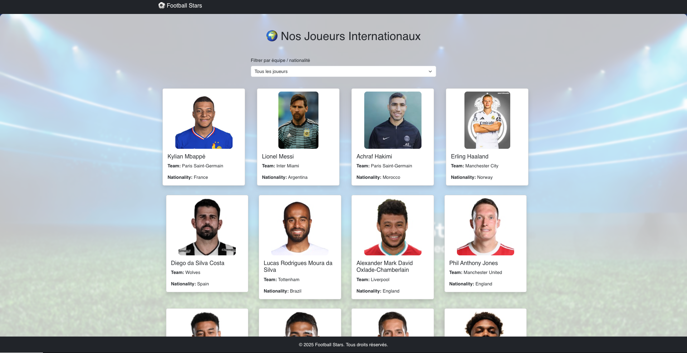

# 🌍 Football Player Showcase



Une application React stylée, dynamique et responsive qui affiche une galerie de joueurs de football avec leurs détails. Ce projet suit un exercice de base enrichi de plusieurs fonctionnalités avancées.

---

## 📘 Objectif initial

L’exercice demandait de :

- Créer un projet avec `create-react-app`
- Créer un fichier `players.js` contenant un tableau de joueurs (JSON)
- Créer un composant `Player.js` qui affiche les données dans une carte React-Bootstrap
- Déstructurer les props dans le composant
- Créer un `PlayersList.js` qui mappe et affiche tous les joueurs
- Utiliser le spread operator pour passer les props
- Définir des **default props**
- Ajouter du **inline styling**
- Importer `PlayersList` dans `App.js` et l’afficher

---

## 🚀 Fonctionnalités ajoutées

### ✅ Design complet
- **Header et Footer fixes**
- **Image de fond** avec overlay transparent
- Interface **centrée, animée, responsive**

### ✅ Dynamisme
- **Modale de détail** au clic sur un joueur
- **Filtre par équipe / nationalité**
- **Animations au survol** des cartes
- **Loader avec spinner** lors du chargement

### ✅ Données API (en option)
- Compatible avec l'[API-FOOTBALL](https://www.api-football.com/)
- Possibilité de charger **plus de 1000 vrais joueurs** dynamiquement

---

## 🛠️ Installation

```bash
git clone https://github.com/votre-utilisateur/player-site.git
cd player-site
npm install
npm start
````

> ⚠️ Si tu veux utiliser l’API-Football :

1. Crée un compte sur [https://www.api-football.com/](https://www.api-football.com/)
2. Récupère ta clé API
3. Remplace `'TON_API_KEY_ICI'` dans `usePlayersApi.js`

---

## 📂 Structure du projet

```
src/
├── App.js
├── App.css
├── data/
│   └── players.js         # Données statiques (optionnel)
├── hooks/
│   └── usePlayersApi.js   # Hook pour récupérer les joueurs via API
├── components/
│   ├── Header.js
│   ├── Footer.js
│   ├── Player.js
│   ├── PlayerModal.js
│   └── PlayersList.js
public/
├── image.png              # Image affichée en haut du README et du site
```

---

## 🖼️ Aperçu visuel

* Liste de joueurs avec carte animée
* Filtrage en dropdown
* Modale responsive
* Design inspiré d’une application pro

---

## 📌 Dépendances utilisées

```bash
npm install react-bootstrap bootstrap animate.css axios
```

---

## 📄 Licence

Ce projet est libre et ouvert pour l’apprentissage. Tu peux le modifier, améliorer et réutiliser pour tes propres projets ou portfolios.

---

## 🙌 Contribution

Tu veux contribuer ? Ajoute :

* Recherche en temps réel
* Pagination
* Connexion à Firebase ou MongoDB
* Système de favoris

---

**💻 Créé avec React & ❤️ pour le foot.**

---# React-Checkpoint-02
